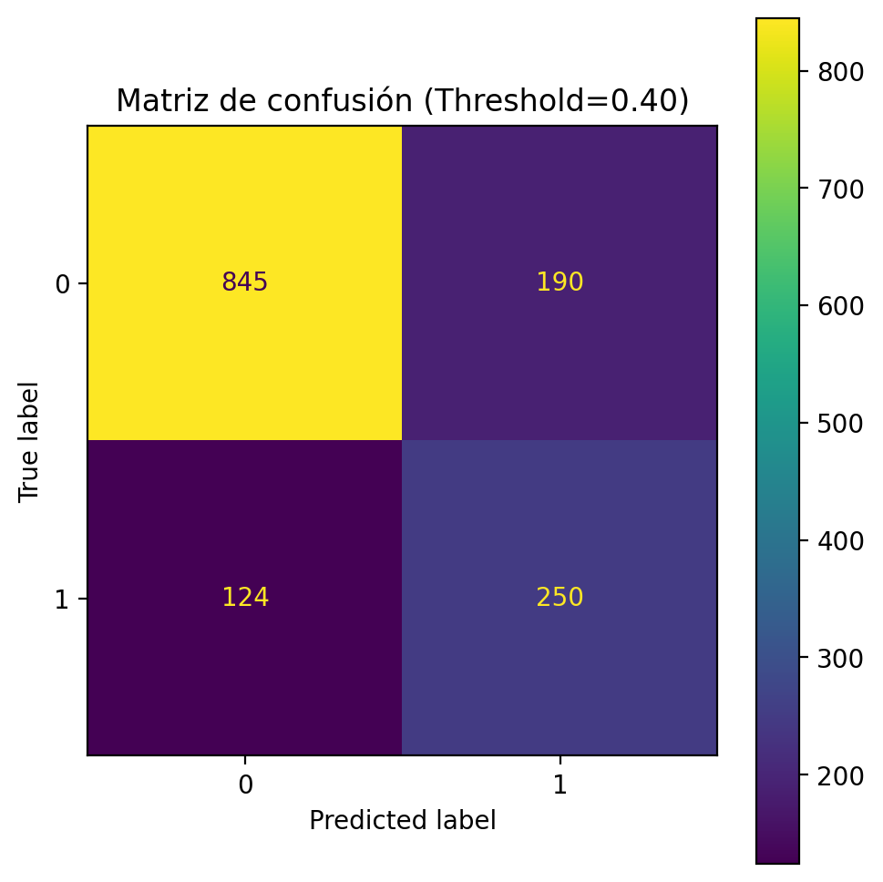
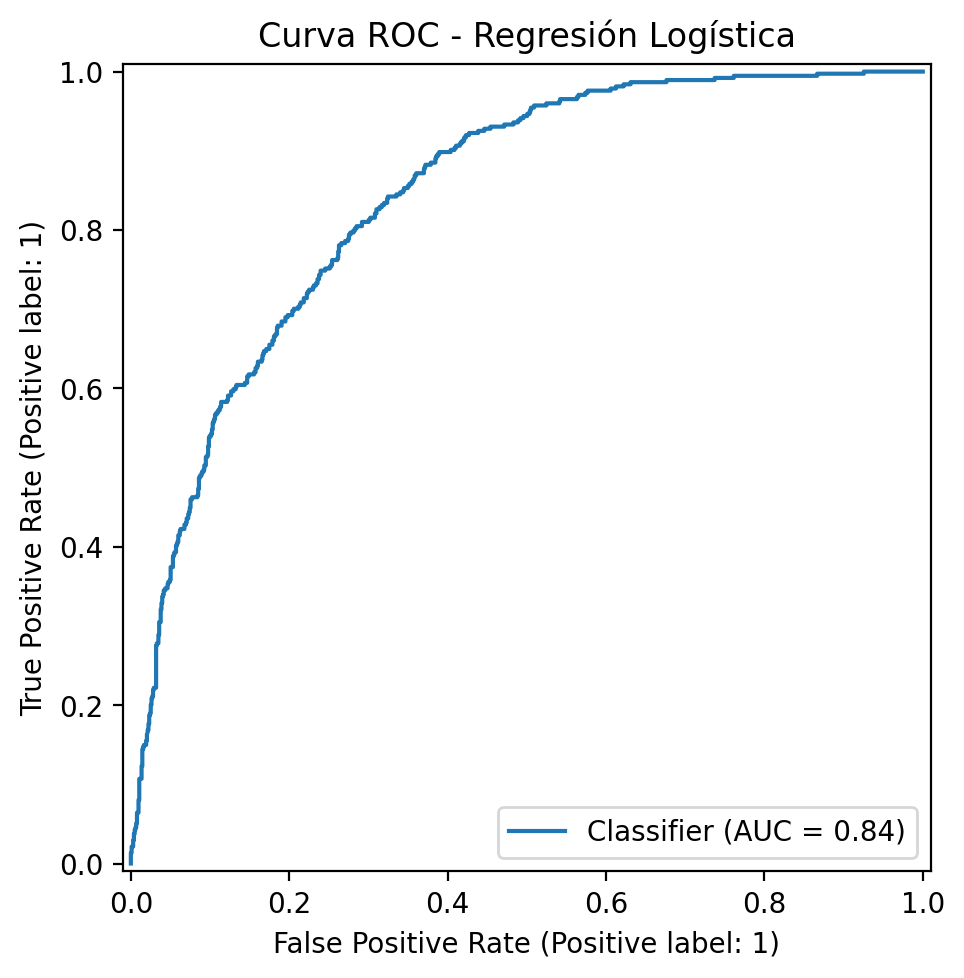
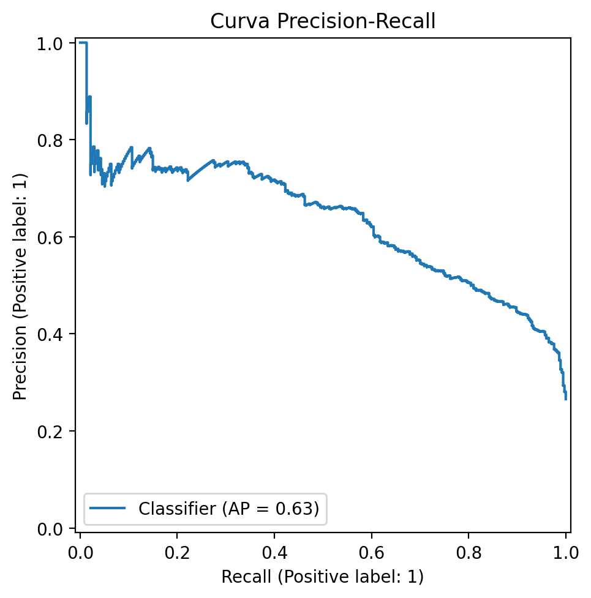
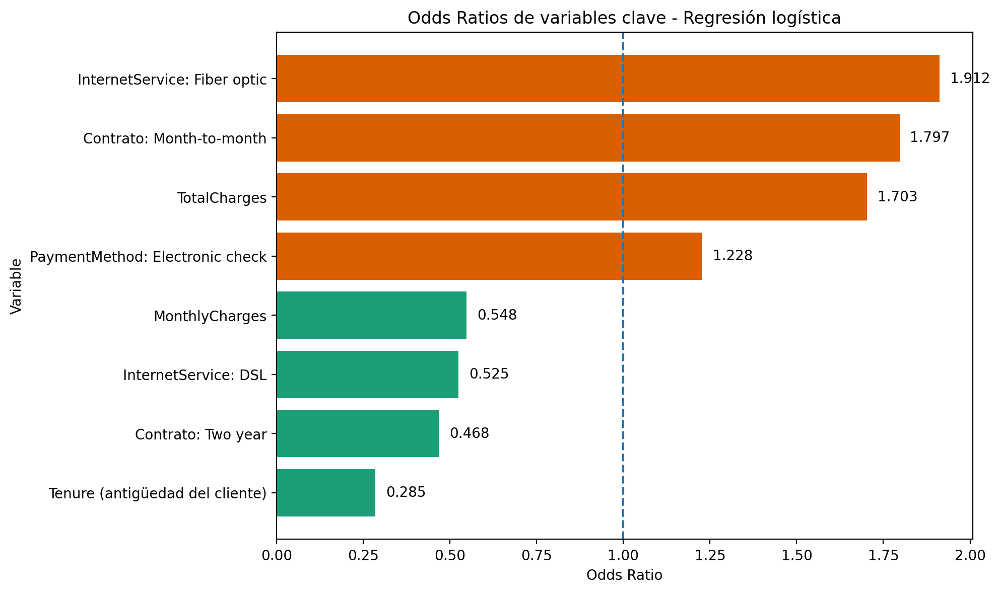
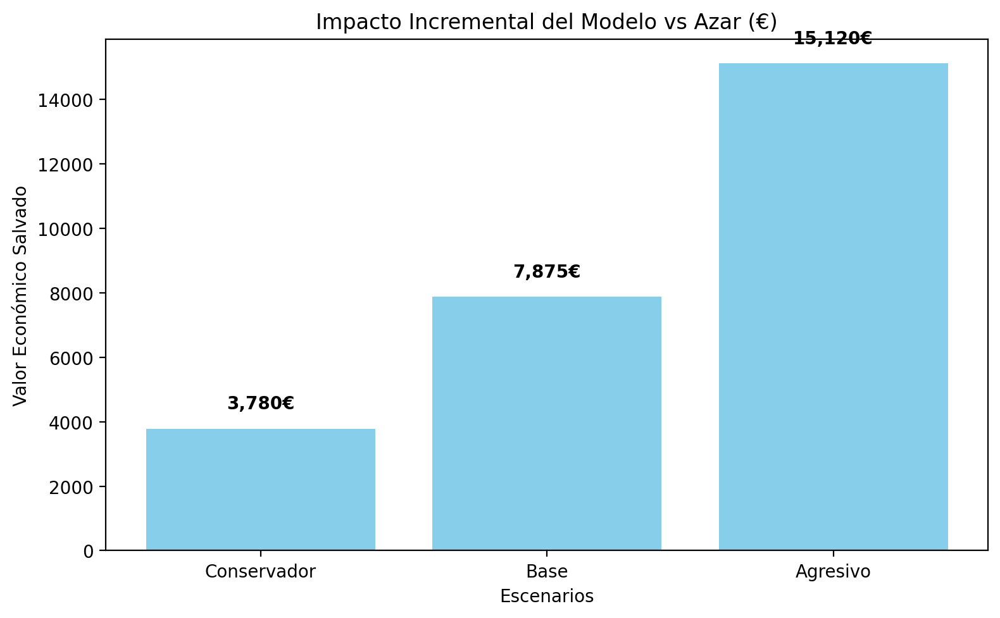

# 📉 TFM Proyecto 1 — Predicción de Churn de Clientes


## Executive Summary

Este repositorio contiene un proyecto *end-to-end* de **machine learning para predicción de churn**, orientado a priorizar acciones de retención sobre el **10% de clientes con mayor riesgo estimado**.

El problema de negocio es claro: en escenarios reales no suele ser posible actuar sobre toda la cartera, por lo que la clave no es solo clasificar correctamente, sino **ordenar a los clientes por nivel de riesgo** para decidir sobre quién intervenir primero.

Tras el análisis exploratorio, la comparación de modelos, la interpretación del modelo y la traducción a impacto económico, se seleccionó una **regresión logística** como modelo principal por ofrecer el mejor equilibrio entre:

- rendimiento técnico,
- interpretabilidad,
- facilidad de despliegue,
- y utilidad operativa.

El modelo principal logró:

- **Accuracy:** 0.8055  
- **Precision:** 0.6572  
- **Recall:** 0.5588  
- **ROC-AUC:** 0.8420  
- **PR-AUC:** 0.6337  
- **Recall@Top10%:** 0.2781  

Frente a una selección aleatoria (`Recall@Top10% = 0.1016`), el modelo captura aproximadamente **2.7 veces más churn real** con la misma capacidad operativa.

---

## 1. Problema de negocio

El objetivo de este proyecto es identificar clientes con mayor probabilidad de abandono para:

- priorizar campañas de retención,
- asignar recursos de forma eficiente,
- y maximizar el valor retenido esperado.

La pregunta de negocio es:

> **¿Qué clientes tienen mayor riesgo de churn y cómo puede priorizarse la intervención sobre un subconjunto limitado de la cartera?**

---

## 2. Dataset

Se utilizó el dataset **Telco Customer Churn**, orientado a clasificación binaria sobre abandono de clientes.

### Variable objetivo
- `Churn = Yes` → el cliente abandona
- `Churn = No` → el cliente permanece

### Distribución observada
- `No`: ~73.5%
- `Yes`: ~26.5%

Esto implica un **desbalance moderado**, por lo que métricas como `accuracy` deben interpretarse con cautela.

### Variables numéricas principales
- `tenure`
- `MonthlyCharges`
- `TotalCharges`

### Variables categóricas relevantes
- `Contract`
- `InternetService`
- `PaymentMethod`
- `OnlineSecurity`
- `TechSupport`
- `PaperlessBilling`
- entre otras

---

## 3. Preparación y calidad del dato

Durante la fase de limpieza se realizaron las siguientes acciones:

- eliminación de `customerID` por ser un identificador sin valor predictivo,
- conversión de `TotalCharges` a numérico,
- detección de missing values implícitos,
- imputación coherente de `TotalCharges = 0` cuando `tenure = 0`,
- separación explícita entre variables numéricas, categóricas y objetivo.

La lógica de preparación quedó modularizada en `src/data/` y `src/features/`, de forma que la limpieza y definición de variables sean reproducibles fuera del notebook.

---

## 4. Hallazgos principales del EDA

El análisis exploratorio permitió identificar patrones muy consistentes con churn:

### Hallazgos numéricos
- **`tenure`**: los churners tienden a ser clientes mucho más recientes.
- **`MonthlyCharges`**: los churners presentan perfiles de precio mensual más altos.
- **`TotalCharges`**: los churners acumulan menos gasto total, coherente con su menor antigüedad.

### Hallazgos categóricos
- **`Contract`**: `Month-to-month` presenta churn claramente mayor que contratos anuales.
- **`InternetService`**: `Fiber optic` aparece asociado a mayor churn que `DSL`.
- **`PaymentMethod`**: `Electronic check` destaca como patrón de mayor riesgo.

---

## 5. Modelado

### 5.1 Baselines
Se calcularon dos referencias mínimas:

- **Baseline mayoritario**: siempre predice `No churn`
- **Baseline aleatorio Top 10%**: selección aleatoria del 10% de clientes

Resultados relevantes:
- Baseline mayoritario → `Accuracy = 0.7346`, `Recall = 0.0000`
- Baseline aleatorio → `Recall@Top10% = 0.1016`

Esto demuestra que una `accuracy` razonable puede esconder un modelo inútil para detectar churn.

---

### 5.2 Comparación de modelos

| Modelo | Accuracy | Precision | Recall | ROC-AUC | PR-AUC | Recall@Top10% |
|---|---:|---:|---:|---:|---:|---:|
| Baseline mayoritario | 0.7346 | 0.0000 | 0.0000 | — | — | 0.1016 |
| Regresión logística | 0.8055 | 0.6572 | 0.5588 | 0.8420 | 0.6337 | 0.2781 |
| Random Forest | 0.7991 | 0.6542 | 0.5160 | 0.8360 | 0.6393 | 0.2888 |
| HistGradientBoosting | 0.7942 | 0.6400 | 0.5134 | 0.8320 | 0.6392 | 0.2754 |

### Selección del modelo principal

Se eligió **regresión logística** como modelo principal porque:

- obtiene el mejor rendimiento global,
- mantiene buen recall sobre churn real,
- es claramente más interpretable,
- y facilita una traducción más sólida a negocio y a despliegue conceptual.

**Random Forest** se mantiene como modelo comparativo secundario, ya que mejora ligeramente `Recall@Top10%`, pero no de forma suficientemente clara como para justificar la pérdida de interpretabilidad.

---

## 6. Visual Highlights

<p align="center">
  
  
  
</p>

---

## 7. Ajuste del threshold

La regresión logística fue evaluada con distintos thresholds para estudiar el trade-off entre `precision` y `recall`.

| Threshold | Accuracy | Precision | Recall | F1 |
|---|---:|---:|---:|---:|
| 0.30 | 0.7495 | 0.5193 | 0.7540 | 0.6150 |
| 0.35 | 0.7644 | 0.5432 | 0.7059 | 0.6140 |
| 0.40 | 0.7771 | 0.5682 | 0.6684 | 0.6143 |
| 0.45 | 0.7892 | 0.6005 | 0.6150 | 0.6077 |
| 0.50 | 0.8055 | 0.6572 | 0.5588 | 0.6040 |
| 0.55 | 0.7991 | 0.6784 | 0.4626 | 0.5501 |
| 0.60 | 0.7991 | 0.7177 | 0.4011 | 0.5146 |

### Threshold recomendado
Se propone un **threshold operativo de 0.40**, porque ofrece un equilibrio razonable entre:

- capacidad de detección de churn,
- coste de falsas alarmas,
- y coherencia con una campaña de retención real.

---

## 8. Explicabilidad

La explicabilidad se abordó en tres niveles:

- **global**
- **local**
- **agrupada**

### 8.1 Explicabilidad global
La regresión logística permitió interpretar el efecto de las variables mediante coeficientes y *odds ratios*.

#### Variables más relevantes
- `tenure` → fuerte factor protector
- `Contract: Two year` → reduce churn
- `Contract: Month-to-month` → aumenta riesgo
- `InternetService: Fiber optic` → aumenta riesgo
- `PaymentMethod: Electronic check` → aumenta riesgo moderadamente

<p align="center">
  
</p>

### 8.2 Explicabilidad local
Se analizaron casos concretos para explicar:

- un **true positive** de alto riesgo,
- y un **false positive** con perfil muy similar a churn.

Esto permitió mostrar que el modelo estima **probabilidades de riesgo**, no certezas absolutas.

### 8.3 Explicabilidad agrupada
Se estudió el **top 10% de clientes con mayor probabilidad estimada de churn**.

El perfil colectivo de mayor riesgo quedó caracterizado por:

- baja antigüedad,
- contrato mensual,
- `Fiber optic`,
- `Electronic check`,
- ausencia de `OnlineSecurity`,
- ausencia de `TechSupport`.

Esta capa agrupada conecta directamente la explicabilidad con la priorización operativa.

---

## 9. Impacto de negocio

La métrica más alineada con el caso de uso fue `Recall@Top10%`, ya que representa un escenario donde la empresa solo puede actuar sobre el **10% de clientes con mayor riesgo estimado**.

### Resultado clave
- `Recall@Top10% modelo = 0.2781`
- `Recall@Top10% azar = 0.1016`

Esto implica que el modelo captura aproximadamente **2.7 veces más churn real** que una selección aleatoria.

### Traducción operativa sobre el test
En el top 10% del conjunto de test:
- **clientes contactados:** 140
- **churners capturados por el modelo:** 104
- **churners capturados al azar:** 41

### Escenarios económicos

| Escenario | TopK | Clientes contactados | Churners capturados modelo | Churners capturados azar | Impacto neto modelo | Impacto neto azar | Impacto incremental |
|---|---:|---:|---:|---:|---:|---:|---:|
| Conservador | 0.10 | 140 | 104 | 41 | 4840 | 1060 | 3780 |
| Base | 0.10 | 140 | 104 | 41 | 10900 | 3025 | 7875 |
| Agresivo | 0.10 | 140 | 104 | 41 | 22160 | 7040 | 15120 |

<p align="center">
  
</p>

### Lectura de negocio
Con la misma capacidad operativa, el modelo identifica significativamente más churn real que una campaña aleatoria y genera un impacto incremental positivo en todos los escenarios planteados.

---

## 10. Despliegue conceptual en producción

El proyecto no implementa una plataforma completa de MLOps, pero sí plantea una arquitectura conceptual realista para producción.
Para una descripción más detallada del despliegue conceptual, ver [`docs/deployment_concept.md`](docs/deployment_concept.md).

### Componentes clave
- notebooks convertidos progresivamente a scripts reutilizables,
- pipeline serializado de scikit-learn,
- entorno reproducible con `venv` + `requirements.txt`,
- serving mediante API,
- opción de contenerización con Docker,
- monitorización básica,
- reentrenamiento periódico.

### Flujo conceptual
1. un sistema aguas arriba envía datos del cliente,
2. la API carga el pipeline,
3. aplica el preprocesado,
4. calcula la probabilidad de churn,
5. aplica el threshold operativo,
6. devuelve predicción y, opcionalmente, drivers de riesgo.

### Producción y mantenimiento
En un entorno real, el sistema debería incluir:
- versionado de modelo,
- seguimiento de métricas,
- monitorización de drift,
- y reentrenamiento periódico con datos nuevos.

---

## 11. Estructura del repositorio

```text
TFM-PROYECTO1-CHURN/
│
├── README.md
├── requirements.txt
├── .gitignore
│
├── data/
│   ├── raw/
│   └── processed/
│
├── notebooks/
│   ├── 01_data_understanding_eda.ipynb
│   ├── 02_modeling_and_evaluation.ipynb
│   ├── 03_explainability.ipynb
│   └── 04_business_impact_and_threshold.ipynb
│
├── src/
│   ├── business/
│   ├── data/
│   ├── explainability/
│   ├── features/
│   ├── models/
│   └── utils/
│
├── models/
│   └── logistic_pipeline.joblib
│
├── reports/
│   ├── figures/
│   │   ├── business/
│   │   └── models/
│   └── tables/
│
├── docs/
└── tests/
```

---

## 12. Reproducibilidad

### Instalación
Crear y activar entorno virtual, e instalar dependencias:

```bash
pip install -r requirements.txt
```

### Ejecuciones principales

```bash
python -m src.models.train_logistic
python -m src.models.compare_models
python -m src.models.threshold_analysis
python -m src.business.business_impact
python -m src.explainability.global_explainability
python -m src.explainability.grouped_explainability
python -m src.models.plot_model_results
python -m src.business.plot_business_impact
```

---
## Notebooks

Para una versión más didáctica y secuencial del proyecto, el repositorio incluye los siguientes notebooks:

- [`01_data_understanding_eda.ipynb`](notebooks/01_data_understanding_eda.ipynb): carga, limpieza y análisis exploratorio del dataset.
- [`02_modeling_and_evaluation.ipynb`](notebooks/02_modeling_and_evaluation.ipynb): baselines, entrenamiento, comparación de modelos y selección del modelo final.
- [`03_explainability.ipynb`](notebooks/03_explainability.ipynb): explicabilidad global, local y agrupada del modelo seleccionado.
- [`04_business_impact_and_threshold.ipynb`](notebooks/04_business_impact_and_threshold.ipynb): análisis de thresholds, priorización operativa e impacto de negocio.

## 13. Conclusión final

Este proyecto demuestra que es posible construir un sistema de predicción de churn:

- técnicamente sólido,
- interpretable,
- orientado a negocio,
- y con una propuesta razonable de producción.

La solución final basada en:

- **regresión logística**
- **threshold operativo = 0.40**
- **priorización del top 10% de clientes con mayor riesgo**

constituye una propuesta defendible tanto desde el punto de vista analítico como desde la perspectiva operativa.