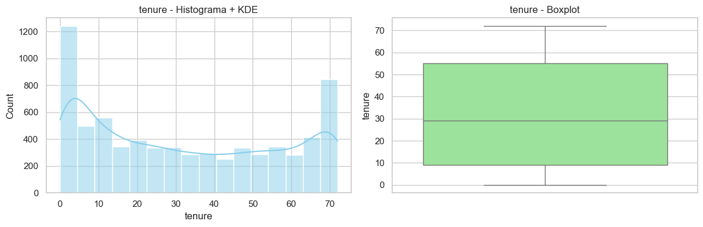
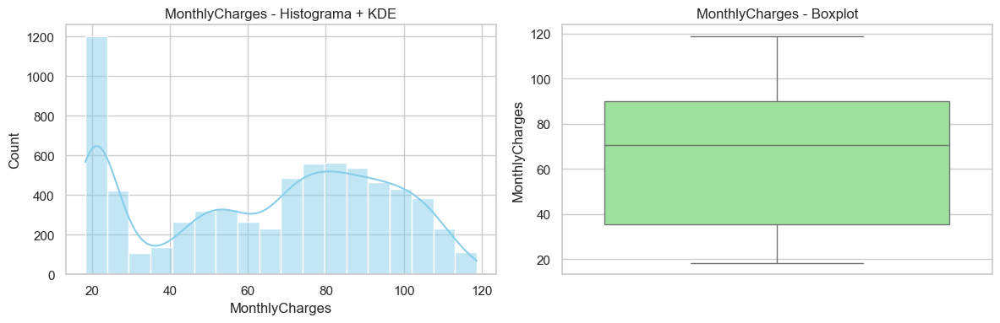
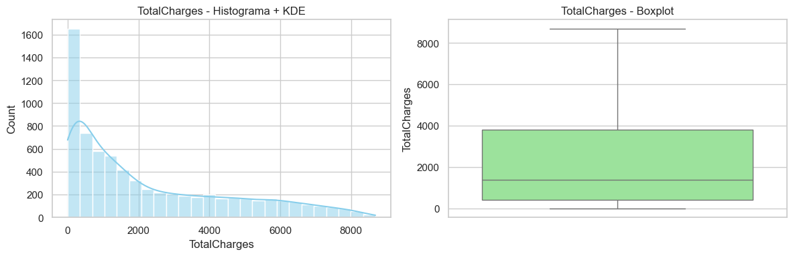
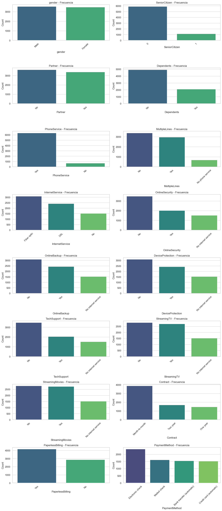
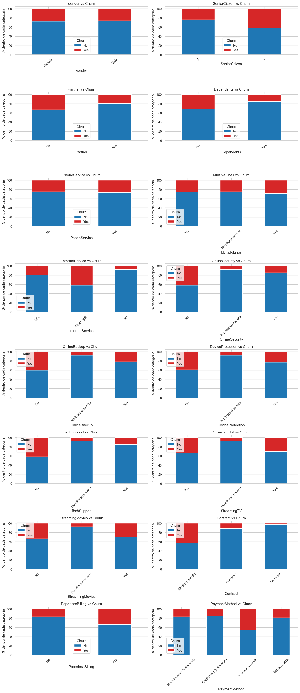
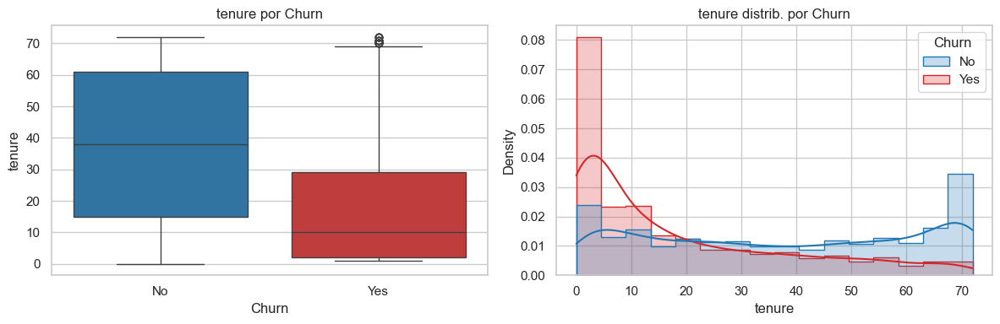
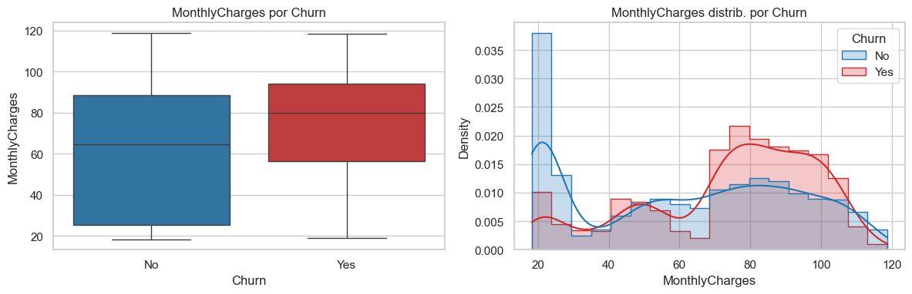
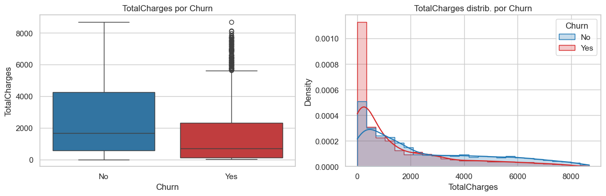

# 01 — Data Understanding & EDA

## Objetivo
Este notebook documenta la carga, limpieza y análisis exploratorio inicial del dataset de churn. El propósito es:

1. validar la calidad del dato,
2. entender la estructura de variables numéricas y categóricas,
3. identificar patrones preliminares asociados al churn,
4. y dejar preparado el dataset para la fase de modelado.

## Preguntas que responde
- ¿Cuál es la estructura del dataset?
- ¿Qué transformaciones de limpieza son necesarias?
- ¿Qué variables parecen más relacionadas con el churn?
- ¿Qué hallazgos de negocio emergen antes del modelado?


```python
from pathlib import Path
import sys

# Buscar la raíz del proyecto (la carpeta que contiene "src")
PROJECT_ROOT = Path.cwd().resolve()

while not (PROJECT_ROOT / "src").exists() and PROJECT_ROOT != PROJECT_ROOT.parent:
    PROJECT_ROOT = PROJECT_ROOT.parent

if str(PROJECT_ROOT) not in sys.path:
    sys.path.append(str(PROJECT_ROOT))

print("PROJECT_ROOT =", PROJECT_ROOT)
```

    PROJECT_ROOT = C:\repos\tfm-proyecto1-churn
    


```python
import pandas as pd
import numpy as np
import matplotlib.pyplot as plt
import seaborn as sns

from scipy.stats import skew, kurtosis

# Importaciones de nuestros módulos (conectando con la carpeta src)
from src.data.load_data import load_telco_data
from src.data.clean_data import clean_telco_data
from src.features.feature_lists import TARGET, CAT_COLS, NUM_COLS

sns.set(style="whitegrid")
plt.rcParams["figure.figsize"] = (10, 5)
import warnings
warnings.filterwarnings('ignore')
```


```python
df_raw = load_telco_data()
df_raw.head()
```


<div>
<style scoped>
    .dataframe tbody tr th:only-of-type {
        vertical-align: middle;
    }

    .dataframe tbody tr th {
        vertical-align: top;
    }

    .dataframe thead th {
        text-align: right;
    }
</style>
<table border="1" class="dataframe">
  <thead>
    <tr style="text-align: right;">
      <th></th>
      <th>customerID</th>
      <th>gender</th>
      <th>SeniorCitizen</th>
      <th>Partner</th>
      <th>Dependents</th>
      <th>tenure</th>
      <th>PhoneService</th>
      <th>MultipleLines</th>
      <th>InternetService</th>
      <th>OnlineSecurity</th>
      <th>...</th>
      <th>DeviceProtection</th>
      <th>TechSupport</th>
      <th>StreamingTV</th>
      <th>StreamingMovies</th>
      <th>Contract</th>
      <th>PaperlessBilling</th>
      <th>PaymentMethod</th>
      <th>MonthlyCharges</th>
      <th>TotalCharges</th>
      <th>Churn</th>
    </tr>
  </thead>
  <tbody>
    <tr>
      <th>0</th>
      <td>7590-VHVEG</td>
      <td>Female</td>
      <td>0</td>
      <td>Yes</td>
      <td>No</td>
      <td>1</td>
      <td>No</td>
      <td>No phone service</td>
      <td>DSL</td>
      <td>No</td>
      <td>...</td>
      <td>No</td>
      <td>No</td>
      <td>No</td>
      <td>No</td>
      <td>Month-to-month</td>
      <td>Yes</td>
      <td>Electronic check</td>
      <td>29.85</td>
      <td>29.85</td>
      <td>No</td>
    </tr>
    <tr>
      <th>1</th>
      <td>5575-GNVDE</td>
      <td>Male</td>
      <td>0</td>
      <td>No</td>
      <td>No</td>
      <td>34</td>
      <td>Yes</td>
      <td>No</td>
      <td>DSL</td>
      <td>Yes</td>
      <td>...</td>
      <td>Yes</td>
      <td>No</td>
      <td>No</td>
      <td>No</td>
      <td>One year</td>
      <td>No</td>
      <td>Mailed check</td>
      <td>56.95</td>
      <td>1889.5</td>
      <td>No</td>
    </tr>
    <tr>
      <th>2</th>
      <td>3668-QPYBK</td>
      <td>Male</td>
      <td>0</td>
      <td>No</td>
      <td>No</td>
      <td>2</td>
      <td>Yes</td>
      <td>No</td>
      <td>DSL</td>
      <td>Yes</td>
      <td>...</td>
      <td>No</td>
      <td>No</td>
      <td>No</td>
      <td>No</td>
      <td>Month-to-month</td>
      <td>Yes</td>
      <td>Mailed check</td>
      <td>53.85</td>
      <td>108.15</td>
      <td>Yes</td>
    </tr>
    <tr>
      <th>3</th>
      <td>7795-CFOCW</td>
      <td>Male</td>
      <td>0</td>
      <td>No</td>
      <td>No</td>
      <td>45</td>
      <td>No</td>
      <td>No phone service</td>
      <td>DSL</td>
      <td>Yes</td>
      <td>...</td>
      <td>Yes</td>
      <td>Yes</td>
      <td>No</td>
      <td>No</td>
      <td>One year</td>
      <td>No</td>
      <td>Bank transfer (automatic)</td>
      <td>42.30</td>
      <td>1840.75</td>
      <td>No</td>
    </tr>
    <tr>
      <th>4</th>
      <td>9237-HQITU</td>
      <td>Female</td>
      <td>0</td>
      <td>No</td>
      <td>No</td>
      <td>2</td>
      <td>Yes</td>
      <td>No</td>
      <td>Fiber optic</td>
      <td>No</td>
      <td>...</td>
      <td>No</td>
      <td>No</td>
      <td>No</td>
      <td>No</td>
      <td>Month-to-month</td>
      <td>Yes</td>
      <td>Electronic check</td>
      <td>70.70</td>
      <td>151.65</td>
      <td>Yes</td>
    </tr>
  </tbody>
</table>
<p>5 rows × 21 columns</p>
</div>


```python
print("Shape crudo:", df_raw.shape)
df_raw.info()
```

    Shape crudo: (7043, 21)
    <class 'pandas.DataFrame'>
    RangeIndex: 7043 entries, 0 to 7042
    Data columns (total 21 columns):
     #   Column            Non-Null Count  Dtype  
    ---  ------            --------------  -----  
     0   customerID        7043 non-null   str    
     1   gender            7043 non-null   str    
     2   SeniorCitizen     7043 non-null   int64  
     3   Partner           7043 non-null   str    
     4   Dependents        7043 non-null   str    
     5   tenure            7043 non-null   int64  
     6   PhoneService      7043 non-null   str    
     7   MultipleLines     7043 non-null   str    
     8   InternetService   7043 non-null   str    
     9   OnlineSecurity    7043 non-null   str    
     10  OnlineBackup      7043 non-null   str    
     11  DeviceProtection  7043 non-null   str    
     12  TechSupport       7043 non-null   str    
     13  StreamingTV       7043 non-null   str    
     14  StreamingMovies   7043 non-null   str    
     15  Contract          7043 non-null   str    
     16  PaperlessBilling  7043 non-null   str    
     17  PaymentMethod     7043 non-null   str    
     18  MonthlyCharges    7043 non-null   float64
     19  TotalCharges      7043 non-null   str    
     20  Churn             7043 non-null   str    
    dtypes: float64(1), int64(2), str(18)
    memory usage: 1.1 MB
    

**Nota sobre el dataset crudo:** Como podemos observar, el dataset original incluye la columna `customerID` (que no aporta valor predictivo) y la variable `TotalCharges` viene con problemas de tipado (aparece como `object` en lugar de `float`). Aún no se ha aplicado limpieza.


```python
df = clean_telco_data(df_raw)
df.head()
```


<div>
<style scoped>
    .dataframe tbody tr th:only-of-type {
        vertical-align: middle;
    }

    .dataframe tbody tr th {
        vertical-align: top;
    }

    .dataframe thead th {
        text-align: right;
    }
</style>
<table border="1" class="dataframe">
  <thead>
    <tr style="text-align: right;">
      <th></th>
      <th>gender</th>
      <th>SeniorCitizen</th>
      <th>Partner</th>
      <th>Dependents</th>
      <th>tenure</th>
      <th>PhoneService</th>
      <th>MultipleLines</th>
      <th>InternetService</th>
      <th>OnlineSecurity</th>
      <th>OnlineBackup</th>
      <th>DeviceProtection</th>
      <th>TechSupport</th>
      <th>StreamingTV</th>
      <th>StreamingMovies</th>
      <th>Contract</th>
      <th>PaperlessBilling</th>
      <th>PaymentMethod</th>
      <th>MonthlyCharges</th>
      <th>TotalCharges</th>
      <th>Churn</th>
    </tr>
  </thead>
  <tbody>
    <tr>
      <th>0</th>
      <td>Female</td>
      <td>0</td>
      <td>Yes</td>
      <td>No</td>
      <td>1</td>
      <td>No</td>
      <td>No phone service</td>
      <td>DSL</td>
      <td>No</td>
      <td>Yes</td>
      <td>No</td>
      <td>No</td>
      <td>No</td>
      <td>No</td>
      <td>Month-to-month</td>
      <td>Yes</td>
      <td>Electronic check</td>
      <td>29.85</td>
      <td>29.85</td>
      <td>No</td>
    </tr>
    <tr>
      <th>1</th>
      <td>Male</td>
      <td>0</td>
      <td>No</td>
      <td>No</td>
      <td>34</td>
      <td>Yes</td>
      <td>No</td>
      <td>DSL</td>
      <td>Yes</td>
      <td>No</td>
      <td>Yes</td>
      <td>No</td>
      <td>No</td>
      <td>No</td>
      <td>One year</td>
      <td>No</td>
      <td>Mailed check</td>
      <td>56.95</td>
      <td>1889.50</td>
      <td>No</td>
    </tr>
    <tr>
      <th>2</th>
      <td>Male</td>
      <td>0</td>
      <td>No</td>
      <td>No</td>
      <td>2</td>
      <td>Yes</td>
      <td>No</td>
      <td>DSL</td>
      <td>Yes</td>
      <td>Yes</td>
      <td>No</td>
      <td>No</td>
      <td>No</td>
      <td>No</td>
      <td>Month-to-month</td>
      <td>Yes</td>
      <td>Mailed check</td>
      <td>53.85</td>
      <td>108.15</td>
      <td>Yes</td>
    </tr>
    <tr>
      <th>3</th>
      <td>Male</td>
      <td>0</td>
      <td>No</td>
      <td>No</td>
      <td>45</td>
      <td>No</td>
      <td>No phone service</td>
      <td>DSL</td>
      <td>Yes</td>
      <td>No</td>
      <td>Yes</td>
      <td>Yes</td>
      <td>No</td>
      <td>No</td>
      <td>One year</td>
      <td>No</td>
      <td>Bank transfer (automatic)</td>
      <td>42.30</td>
      <td>1840.75</td>
      <td>No</td>
    </tr>
    <tr>
      <th>4</th>
      <td>Female</td>
      <td>0</td>
      <td>No</td>
      <td>No</td>
      <td>2</td>
      <td>Yes</td>
      <td>No</td>
      <td>Fiber optic</td>
      <td>No</td>
      <td>No</td>
      <td>No</td>
      <td>No</td>
      <td>No</td>
      <td>No</td>
      <td>Month-to-month</td>
      <td>Yes</td>
      <td>Electronic check</td>
      <td>70.70</td>
      <td>151.65</td>
      <td>Yes</td>
    </tr>
  </tbody>
</table>
</div>


```python
print("Shape limpio:", df.shape)
df.info()
```

    Shape limpio: (7043, 20)
    <class 'pandas.DataFrame'>
    RangeIndex: 7043 entries, 0 to 7042
    Data columns (total 20 columns):
     #   Column            Non-Null Count  Dtype  
    ---  ------            --------------  -----  
     0   gender            7043 non-null   str    
     1   SeniorCitizen     7043 non-null   int64  
     2   Partner           7043 non-null   str    
     3   Dependents        7043 non-null   str    
     4   tenure            7043 non-null   int64  
     5   PhoneService      7043 non-null   str    
     6   MultipleLines     7043 non-null   str    
     7   InternetService   7043 non-null   str    
     8   OnlineSecurity    7043 non-null   str    
     9   OnlineBackup      7043 non-null   str    
     10  DeviceProtection  7043 non-null   str    
     11  TechSupport       7043 non-null   str    
     12  StreamingTV       7043 non-null   str    
     13  StreamingMovies   7043 non-null   str    
     14  Contract          7043 non-null   str    
     15  PaperlessBilling  7043 non-null   str    
     16  PaymentMethod     7043 non-null   str    
     17  MonthlyCharges    7043 non-null   float64
     18  TotalCharges      7043 non-null   float64
     19  Churn             7043 non-null   str    
    dtypes: float64(2), int64(2), str(16)
    memory usage: 1.1 MB
    

**Nota tras la limpieza:**
- La columna `customerID` ya no está.
- La columna `TotalCharges` ya es numérica y los valores nulos (clientes con `tenure = 0`) han sido imputados lógicamente con 0.
- El dataset queda listo para el EDA y modelado.


```python
print(df[TARGET].value_counts())
print("\nPorcentaje:")
print(df[TARGET].value_counts(normalize=True).round(4) * 100)
```

    Churn
    No     5174
    Yes    1869
    Name: count, dtype: int64
    
    Porcentaje:
    Churn
    No     73.46
    Yes    26.54
    Name: proportion, dtype: float64
    

**Sobre la variable objetivo:**
Estamos ante un problema de clasificación binaria que presenta un **desbalance moderado** (aprox. 73.5% vs 26.5%). Esto nos indica que métricas globales como el `accuracy` por sí solas no serán suficientes para evaluar los modelos futuros; necesitaremos fijarnos en el Recall y Precision.


```python
df[NUM_COLS].describe().T
```


<div>
<style scoped>
    .dataframe tbody tr th:only-of-type {
        vertical-align: middle;
    }

    .dataframe tbody tr th {
        vertical-align: top;
    }

    .dataframe thead th {
        text-align: right;
    }
</style>
<table border="1" class="dataframe">
  <thead>
    <tr style="text-align: right;">
      <th></th>
      <th>count</th>
      <th>mean</th>
      <th>std</th>
      <th>min</th>
      <th>25%</th>
      <th>50%</th>
      <th>75%</th>
      <th>max</th>
    </tr>
  </thead>
  <tbody>
    <tr>
      <th>tenure</th>
      <td>7043.0</td>
      <td>32.371149</td>
      <td>24.559481</td>
      <td>0.00</td>
      <td>9.00</td>
      <td>29.00</td>
      <td>55.00</td>
      <td>72.00</td>
    </tr>
    <tr>
      <th>MonthlyCharges</th>
      <td>7043.0</td>
      <td>64.761692</td>
      <td>30.090047</td>
      <td>18.25</td>
      <td>35.50</td>
      <td>70.35</td>
      <td>89.85</td>
      <td>118.75</td>
    </tr>
    <tr>
      <th>TotalCharges</th>
      <td>7043.0</td>
      <td>2279.734304</td>
      <td>2266.794470</td>
      <td>0.00</td>
      <td>398.55</td>
      <td>1394.55</td>
      <td>3786.60</td>
      <td>8684.80</td>
    </tr>
  </tbody>
</table>
</div>


```python
def plot_numeric_univariate(data, columns):
    for col in columns:
        fig, axes = plt.subplots(1, 2, figsize=(12, 4))

        sns.histplot(data[col], kde=True, ax=axes[0], color="skyblue")
        axes[0].set_title(f"{col} - Histograma + KDE")
        axes[0].set_xlabel(col)

        sns.boxplot(y=data[col], ax=axes[1], color="lightgreen")
        axes[1].set_title(f"{col} - Boxplot")
        axes[1].set_ylabel(col)

        plt.tight_layout()
        plt.show()

        print(f"\n--- {col} ---")
        print(data[col].describe())
        print(f"Asimetría (skew): {skew(data[col].dropna()):.2f}")
        print(f"Curtosis: {kurtosis(data[col].dropna()):.2f}")
        print("-" * 50)


plot_numeric_univariate(df, NUM_COLS)
```


    

    


    
    --- tenure ---
    count    7043.000000
    mean       32.371149
    std        24.559481
    min         0.000000
    25%         9.000000
    50%        29.000000
    75%        55.000000
    max        72.000000
    Name: tenure, dtype: float64
    Asimetría (skew): 0.24
    Curtosis: -1.39
    --------------------------------------------------
    


    

    


    
    --- MonthlyCharges ---
    count    7043.000000
    mean       64.761692
    std        30.090047
    min        18.250000
    25%        35.500000
    50%        70.350000
    75%        89.850000
    max       118.750000
    Name: MonthlyCharges, dtype: float64
    Asimetría (skew): -0.22
    Curtosis: -1.26
    --------------------------------------------------
    


    

    


    
    --- TotalCharges ---
    count    7043.000000
    mean     2279.734304
    std      2266.794470
    min         0.000000
    25%       398.550000
    50%      1394.550000
    75%      3786.600000
    max      8684.800000
    Name: TotalCharges, dtype: float64
    Asimetría (skew): 0.96
    Curtosis: -0.23
    --------------------------------------------------
    

### Conclusión Numérica
- `tenure`: Muestra una distribución bimodal, indicando una gran concentración de clientes muy nuevos (0-5 meses) y clientes muy leales (>60 meses).
- `MonthlyCharges`: Sugiere la existencia de segmentos tarifarios diferenciados (hay picos claros alrededor de 20 y 80 dólares).
- `TotalCharges`: Es una variable acumulativa y, lógicamente, muestra una clara asimetría positiva (skewness > 0).


```python
def plot_categorical_univariate(data, columns, ncols=2):
    n = len(columns)
    nrows = int(np.ceil(n / ncols))

    fig, axes = plt.subplots(nrows, ncols, figsize=(14, 4 * nrows))
    axes = np.array(axes).reshape(-1)

    for i, col in enumerate(columns):
        ax = axes[i]

        counts = data[col].value_counts(dropna=False)
        props = data[col].value_counts(normalize=True, dropna=False) * 100

        sns.barplot(x=counts.index.astype(str), y=counts.values, ax=ax, palette="viridis")
        ax.set_title(f"{col} - Frecuencia")
        ax.set_xlabel(col)
        ax.set_ylabel("Count")
        ax.tick_params(axis="x", rotation=45)

        print(f"\n--- {col} ---")
        summary = pd.DataFrame({
            "count": counts,
            "percentage": props.round(2)
        })
        print(summary)

    for j in range(i + 1, len(axes)):
        axes[j].axis("off")

    plt.tight_layout()
    plt.show()

plot_categorical_univariate(df, CAT_COLS, ncols=2)
```

    
    --- gender ---
            count  percentage
    gender                   
    Male     3555       50.48
    Female   3488       49.52
    
    --- SeniorCitizen ---
                   count  percentage
    SeniorCitizen                   
    0               5901       83.79
    1               1142       16.21
    
    --- Partner ---
             count  percentage
    Partner                   
    No        3641        51.7
    Yes       3402        48.3
    
    --- Dependents ---
                count  percentage
    Dependents                   
    No           4933       70.04
    Yes          2110       29.96
    
    --- PhoneService ---
                  count  percentage
    PhoneService                   
    Yes            6361       90.32
    No              682        9.68
    
    --- MultipleLines ---
                      count  percentage
    MultipleLines                      
    No                 3390       48.13
    Yes                2971       42.18
    No phone service    682        9.68
    
    --- InternetService ---
                     count  percentage
    InternetService                   
    Fiber optic       3096       43.96
    DSL               2421       34.37
    No                1526       21.67
    
    --- OnlineSecurity ---
                         count  percentage
    OnlineSecurity                        
    No                    3498       49.67
    Yes                   2019       28.67
    No internet service   1526       21.67
    
    --- OnlineBackup ---
                         count  percentage
    OnlineBackup                          
    No                    3088       43.84
    Yes                   2429       34.49
    No internet service   1526       21.67
    
    --- DeviceProtection ---
                         count  percentage
    DeviceProtection                      
    No                    3095       43.94
    Yes                   2422       34.39
    No internet service   1526       21.67
    
    --- TechSupport ---
                         count  percentage
    TechSupport                           
    No                    3473       49.31
    Yes                   2044       29.02
    No internet service   1526       21.67
    
    --- StreamingTV ---
                         count  percentage
    StreamingTV                           
    No                    2810       39.90
    Yes                   2707       38.44
    No internet service   1526       21.67
    
    --- StreamingMovies ---
                         count  percentage
    StreamingMovies                       
    No                    2785       39.54
    Yes                   2732       38.79
    No internet service   1526       21.67
    
    --- Contract ---
                    count  percentage
    Contract                         
    Month-to-month   3875       55.02
    Two year         1695       24.07
    One year         1473       20.91
    
    --- PaperlessBilling ---
                      count  percentage
    PaperlessBilling                   
    Yes                4171       59.22
    No                 2872       40.78
    
    --- PaymentMethod ---
                               count  percentage
    PaymentMethod                               
    Electronic check            2365       33.58
    Mailed check                1612       22.89
    Bank transfer (automatic)   1544       21.92
    Credit card (automatic)     1522       21.61
    


    

    


### Conclusión Categórica
- Variables como `Contract`, `InternetService` y `PaymentMethod` muestran distribuciones muy interesantes que podrían ser clave.
- Existen categorías estructurales cruzadas (por ejemplo, si no tienen Internet, aparecen como `No internet service` en múltiples variables de seguridad y soporte).


```python
def plot_categorical_vs_target(data, columns, target="Churn", ncols=2):
    n = len(columns)
    nrows = int(np.ceil(n / ncols))

    fig, axes = plt.subplots(nrows, ncols, figsize=(14, 4 * nrows))
    axes = np.array(axes).reshape(-1)

    for i, col in enumerate(columns):
        ax = axes[i]

        churn_rate = pd.crosstab(data[col], data[target], normalize="index") * 100
        churn_rate.plot(kind="bar", stacked=True, ax=ax, color=['#1f77b4', '#d62728'])

        ax.set_title(f"{col} vs {target}")
        ax.set_ylabel("% dentro de cada categoría")
        ax.set_xlabel(col)
        ax.tick_params(axis="x", rotation=45)
        ax.legend(title=target)

    for j in range(i + 1, len(axes)):
        axes[j].axis("off")

    plt.tight_layout()
    plt.show()

plot_categorical_vs_target(df, CAT_COLS, target=TARGET, ncols=2)
```


    

    


```python
def plot_numeric_vs_target(data, columns, target="Churn"):
    for col in columns:
        fig, axes = plt.subplots(1, 2, figsize=(12, 4))

        # Boxplot en el primer eje
        sns.boxplot(
            data=data,
            x=target,
            y=col,
            ax=axes[0],
            palette=["#1f77b4", "#d62728"]
        )
        axes[0].set_title(f"{col} por {target}")

        # Histograma / densidad en el segundo eje
        sns.histplot(
            data=data,
            x=col,
            hue=target,
            kde=True,
            element="step",
            stat="density",
            common_norm=False,
            ax=axes[1],
            palette=["#1f77b4", "#d62728"]
        )
        axes[1].set_title(f"{col} distrib. por {target}")

        plt.tight_layout()
        plt.show()

        print(f"\n=== {col} por {target} ===")
        print(data.groupby(target)[col].describe().round(2))
        print("-" * 60)


plot_numeric_vs_target(df, NUM_COLS, target=TARGET)
```


    

    


    
    === tenure por Churn ===
            count   mean    std  min   25%   50%   75%   max
    Churn                                                   
    No     5174.0  37.57  24.11  0.0  15.0  38.0  61.0  72.0
    Yes    1869.0  17.98  19.53  1.0   2.0  10.0  29.0  72.0
    ------------------------------------------------------------
    


    

    


    
    === MonthlyCharges por Churn ===
            count   mean    std    min    25%    50%   75%     max
    Churn                                                         
    No     5174.0  61.27  31.09  18.25  25.10  64.43  88.4  118.75
    Yes    1869.0  74.44  24.67  18.85  56.15  79.65  94.2  118.35
    ------------------------------------------------------------
    


    

    


    
    === TotalCharges por Churn ===
            count     mean      std    min    25%      50%      75%      max
    Churn                                                                   
    No     5174.0  2549.91  2329.95   0.00  572.9  1679.52  4262.85  8672.45
    Yes    1869.0  1531.80  1890.82  18.85  134.5   703.55  2331.30  8684.80
    ------------------------------------------------------------
    

## 🎯 Hallazgos clave del EDA

El análisis exploratorio muestra una señal clara para el problema de churn.

### Hallazgos principales

- Los clientes con menor `tenure` (antigüedad) presentan un riesgo significativamente mayor de abandono.
- El contrato `Month-to-month` aparece fuertemente asociado a mayor churn, mientras que los contratos de mayor duración actúan como un factor protector.
- Los clientes con `Fiber optic` y método de pago `Electronic check` muestran un perfil consistentemente más frágil frente al abandono.
- Los churners tienden a presentar `MonthlyCharges` más altos, pero `TotalCharges` más bajos, un patrón coherente con su menor antigüedad en la compañía.

### Conclusión

El dataset contiene patrones lógicos, consistentes y suficientemente informativos como para justificar una fase de modelado supervisado. En conjunto, el EDA sugiere que el churn no se distribuye aleatoriamente, sino que está relacionado con variables de antigüedad, estructura contractual, tipo de servicio y patrón de pago. El siguiente paso será construir baselines, comparar modelos y seleccionar una solución final equilibrando rendimiento, interpretabilidad e impacto de negocio.
